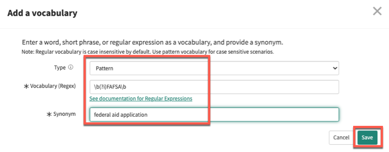
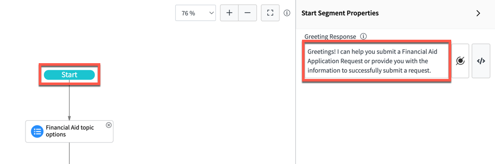
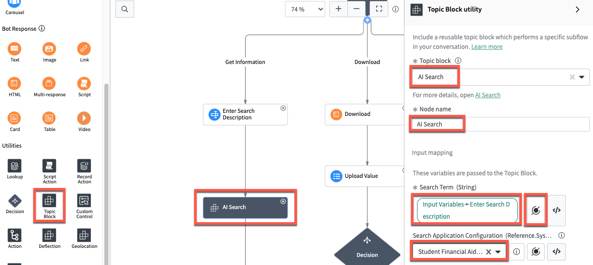
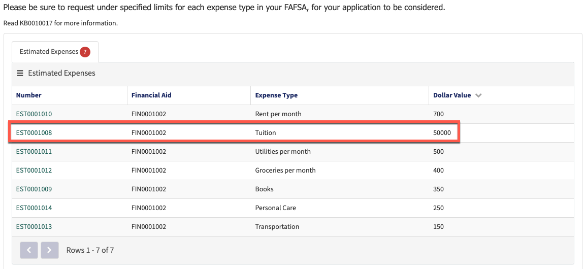

# Setup

## Abstract

Discover how conversational interfaces and document processing are transforming the way we work. Explore the power of *Now Intelligence* to automate tasks and simplify workflows for end users. Learn how this technology can streamline processes, improve productivity, and enable businesses to stay ahead in an ever-changing digital landscape. Whether you're a technical expert or simply interested in the future of work, don't miss this game-changing session.

## Lab Overview

This lab is designed to provide the participant with hands-on experience to create, test, connect and publish some of the AI capabilities on the ServiceNow Platform.

In this lab, participants will enhance a **custom application called Student Financial Aid** using the latest platform AI powered capabilities with the features of **Natural Language Understanding (NLU), AI Search (AIS), Virtual Agent (VA)** and **Document Intelligence (DocIntel)**. Participants will enhance an app that helps process student Financial Aid Application requests. The app will have the ability to intake Financial Aid Application request details from PDFs via Virtual Agent and review students eligibility to offer quick fulfillment of a students application.

For this lab, we will create Financial Aid requests as students of an educational institution named **University of Now**. Our app enhancements will include the following:

1. A NLU Model called *Financial Aid Services* consisting of the following:

    - 5 intents, including 1 intent around submitting financial aid requests
    - A vocabulary library as part of tuning to assist the model in understanding certain unknown words

1. A AI Search Profile called *Student Financial Aid Profile* consisting of the following:

    - A Search Source for the Applications Knowledge Base
    - A Genius Result configuration to retrieve most relevant articles

1. A Virtual Agent topic called *Financial Aid Request VA Flow* consisting of the following:

    - Utilizing NLU to trigger the flow
    - Create Financial Aid Requests to trigger Document Intelligence
    - Utilizing AI Search to search the knowledge base for relevant information

1. A Document Intelligence definition called *Financial Aid Request Form* consisting of the following:

    - Fields and Field Groups to extract the data
    - Flow Designer flows to help with the assignment of extracted data from PDFs

1. Several Test Cases with provided PDFs to test out the application in the complete state

### Prerequisites

The reader is expected to have basic knowledge of the ServiceNow Platform, custom applications and Virtual Agent. No actions are required prior to reading this lab.

### Installed Plugins:

- Glide Virtual Agent
- ITSM Virtual Agent Conversation
- ITSM NLU Model for Virtual Agent Conversations
- Document Intelligence
- AI Search 
- Advanced AI Search Management Tools
- Virtual Agent Designer

### Installed Scoped Application:

- Student Financial Aid 

### Provided Data:

- PDFs to test DocIntel
- Sample Knowledge Articles
- User Records for Validation
- NLU Intent and Utterances
- AI Search Profile
- Virtual Agent Flow Template
- Document Intelligent Use Case

## Enable AIML Capabilities

1. To enable AIML capabilities, students will need to login once as the *aislab.admin* user and run the *Repair Machine Learning Settings* tool

1. Update the URL on your browser and type the following: <*instance_name*>.lab.service-now.com/login.do

    > You will be navigated to the login screen

1. Enter the following credentials:
    User name: **aislab.admin**
    Password: **aislab.admin**

1. Once logged in, using the Filter Navigator, navigate to **Lab Management > Repair Machine Learning Settings**

    

    > Note: You may need to change the scope to Global in order to do this step

1. Click the blue **Reset Machine Learning Settings** button to run the repair tool. The repair may take up to 90 seconds to complete, so please be patient.

    

1. Once the repair is completed, logout of the instance and login with the provided lab student credentials.

## First Things First

1. As an Administrator to your lab instance you will have access to the application and update set menu.

1. This menu is located on the top right of the screen. Click on the **Globe** icon.

1. Click on **Application Scope: Global** and type **Student Financial Aid** into the *Filter* and select the application.

    > Note: The page will refresh once you select the application scope

    

1. Once again click on the **Globe** icon and verify that the *Default # [ Student Financial Aid ]* update set is selected.

    

1. *Optional:* If you wish to work in a different update set you are more than welcome to create one by typing and selecting **Local Update Sets** into the Filter Navigator. Once on the table click on the blue **New** button to the top right to open an Update set form. Fill out the form to your liking and click **Submit and Make Current**.

    

Looks like we are ready to get started!

# Exercise 1: Create NLU Model

## Goal

The objective of this exercise is to introduce the lab participant to NLU workbench and to touch upon some of NLU's tuning capabilities. For the purpose of our application, two (2) custom intents will be introduced that have relation to our Financial Aid Request application. The model will also have other intents from OOB Setup Topic NLU Model to support the Virtual Agent.  

## Review *Financial Aid Services - Untuned* NLU Model in NLU workbench 

1. Using the Filter Navigator, navigate to **NLU Workbench > Models**

    

    > Note: If prompted with a pop-up, please click **Do this later**

1. From the list layout locate and open the NLU Model with name **Financial Aid Services - Untuned**

    

1. Under the *Model management phases* header, within the *Build and train your model*, click the **View phase** button to the far right to begin editing the model.

    

1. Under the *Intents* tab, verify that there are 5 intents loaded in your model
    - #Check Financial Aid Request Status
    - #End Conversations
    - #Live Agent
    - #Submit Student Financial Aid Request
    - #What Can You Do

    

1. Under the *Intents* tab click on the **Submit Student Financial Aid Request** intent

1. Review the list of utterances to understand the variations of different ways this intent is represented so that an intent match with our upcoming Virtual Agent topic Exercise will trigger

1. On the breadcrumb header, click **Build and train your model** to navigate back to model management

1. Similarly, review the train utterance samples for the **Check Financial Aid Request Status** intent

## Duplicate the *Financial Aid Services* NLU Model for the purpose of tuning during the lab for use in VA

1. From the NLU Model home page, locate the NLU Model with the name **Financial Aid Services - Untuned**

    > Note: Use the breadcrumbs to navigate back to NLU *Home*

1. Click on the 3 dots next to the Editors column for this model

1. Select **Duplicate this model** option

    

1. Fill out the pop-up form with the following information

    | Field | Value |
    |-------|-------|
    | Model Name | Financial Aid Services (Tuned) |
    | Description | Tuned NLU Model for Financial Aid application services |

1. Click **Duplicate**

    

1. Your duplicate model **Financial Aid Services (Tuned)** which we will be tuning in this lab will now be created

    > Note: You may have to click **View Model** to be redirected to the model management page

## Train and Test the model to understanding some tuning opportunities

1. Now that you have duplicated the untuned model and reviewed the 2 intents, click on **View phase** within the *Build and train your model section* to manage your model

1. On the right hand side click the green **Train** button

    > Note: The model has never been trained. Clicking **Train** will use all 5 intents and their utterances to generate a model. This might take 30 - 60 seconds

    
    
1. Once training completes, lets test a few sample utterances to see how the current model is performing

    > Note: NLU intent prediction scores may vary +/- a few percentage points from this Lab Guide. Not a cause for alarm if it is not an exact match. References provided here are directional indications.

### Test sample 1: 'FINAID9999999 state'

1. Click on **Try model** on the right hand side bar and enter the test sample **FINAID9999999 state**. Click **Go**.

    > Note down the result. The model most likely returns a result match with the *Submit Student Financial Aid Request* intent with a confidence of around 70%

    
  
1. The expected intent should be *Check Financial Aid Request Status* intent, as the user is asking for the state of their submitted financial aid request. However, this intent's prediction confidence is much lower at around 60% causing unexpected behaviour.

### Test sample 2: 'Turning in a FAFSA'

1. Continue to keep the *Try model* side bar open and enter the test sample **Turning in a FAFSA**

1. Observe that there is no intent. The model *may* match with the *End Conversation* intent at around 60% which is below the model thresholds highlighted in dark grey.

    

1. The expected intent should be *Submit Student Financial Aid Request* intent cause the user is asking to process their financial aid request

### Test sample 3: 'FAFSA upload'

1. Enter the test sample **FAFSA upload**

1. Observe that there is no intent match with any intent even below model threshold

    

1. The expected intent should be *Submit Student Financial Aid Request* intent cause the user is asking to upload their financial aid request

### Test sample 4: 'I need to upload my aid application'

1. Enter the test sample **I need to upload my aid application**

1. Observe that there is a result match with *Check Financial Aid request status* which is not correct

    

1. The expected intent should be *Submit Student Financial Aid Request* intent cause the user is asking to upload their financial aid request

### Test sample 5: 'I didn't complete my FAFSA'

1. Enter the test sample **I didn't complete my FAFSA**

1. Observe that there is a result match with *Check Financial Aid request status* intent which is not correct

    

1. The expected intent should be *Submit Student Financial Aid Request* intent cause the user is stating that their financial aid request is not completed.

We will now fix all of these prediction mismatches in the next step as part of our tuning exercises.

## Address the issues found during testing by tuning the NLU Model

Now that we have tested our base model with some samples, we can begin to tune the model so that it will predict as expected with the tested samples.

### Tune the model for Test sample 1: 'FINAID9999999 state' and retrain and test the model

In order to tune the model, *Vocabulary* will be added to make the model understand the concept of FINAID999999

1. Click on the **Vocabulary** tab

1. Under the *Vocabulary* header click on **+ Add a vocabulary**

1. Create the vocabulary as per below and click **Save**

    | Field | Value |
    |-------|-------|
    | Type | Pattern |
    | Vocabulary (Regex) | ```\b(?i)FINAID\d{0,}\b``` |
    | Synonym | financial aid request record |

    > Note: Ensure there are no typos in your Regex.

    

    > We have created a vocabulary that recognizes the term 'FINAID' followed by numbers as a financial request record. When NLU encounters a value like 'FINAID9999999' in the test utterance, it will process it as a financial aid request record and understand the full user term accordingly.

1. **Train** the model

    

1. Once the model has trained, open the *Try model* tab and enter the test sample **FINAID9999999 state**

1. Observe that NLU now returns the *Check Financial Aid Request Status* Intent with a satisfying prediction confidence score

    

### Tune the model around Test sample 2: 'turning in a FAFSA' and retrain and test the model

We will now add a train utterance to the *Submit Student Financial Aid Request* intent.

1. Return to the *Intents* associated to the model and click on the **Submit Student Financial Aid Request** intent.

1. Type the folllowing utterance into the test box **I want to turn in my FAFSA** and click **Add**

    

1. By adding this sample, we added the concept of *FAFSA* into the intent to allow it to associate similar test utterances to this intent

1. Now **Train** the model

    

1. Once the model has trained, on the *Try model* tab, enter the test sample **turning in a FAFSA**

1. Observe that NLU now returns the *Submit Student Financial Aid Request* intent with around 85% prediction confidence

### Tune the model around Test sample 3: 'FAFSA upload' and retrain and test the model

We will now add *Vocabulary* to make the model understand the concept of FAFSA more closely.

1. Navigate back to the **Build and train your model** page

1. Click on the **Vocabulary** tab

1. Under the *Vocabulary* header click on **+ Add a vocabulary**

1. Create the vocabulary as per below and click **Save**:

    | Field | Value |
    |-------|-------|
    | Type | Pattern |
    | Vocabulary (Regex) | ```\b(?i)FAFSA\b``` |
    | Synonym | federal aid application |

    

1. Ensure no typos in your Regex

    > We have successfully created a vocabulary that recognizes the term *FAFSA* as a *federal aid application*

    > Although we previously added a train sample in our intent on Test Sample 2, there was not enough context for *FAFSA upload* in the intent

1. **Train** the model

    

1. Once the model has trained, on the *Try model* tab, enter the test sample **FAFSA upload**

1. Observe that NLU now returns the *Submit Student Financial Aid Request* intent with around 83% prediction confidence

### Tune the model around Test sample 4: 'I still need to upload my aid application' and retrain and test the model

We will now add an utterance to the *Submit Student Financial Aid Request* intent to provide additional context.

1. Navigate back to the **Build and train your model** page

1. Click on the **Intents** tab

1. Click on the **Submit Student Financial Aid Request** intent

1. Add the following new utterance **I need to upload my aid application**

    

    > By adding this sample, we add a similar utterance like the test sample to make NLU understand the concept.

1. Train the model.

    

1. Once the model has trained, on the *Try model* tab, enter the test sample **I need to upload my aid application**

1. Observe that NLU now returns the *Submit Student Financial Aid Request* intent with around 90% prediction confidence

### Tune the model around Test sample 5: 'I didn't complete my FAFSA' and retrain and test the model

We will now add an utterance to the *Submit Student Financial Aid Request* intent to provide additional context.

1. Navigate back to the **Build and train your model** page

1. Click on the **Intents** tab

1. Click on the *Submit Student Financial Aid Request* intent

1. Add the following new utterance **I didn't complete my FAFSA submission**

    

    > By adding this sample, we add a similar utterance like the test sample with a little more context with the word 'submission' and the vocabulary for 'FAFSA' which we already added for the previous test sample. This will allow NLU to understand the concept and match the intent.

1. **Train** the model


1. Once the model has trained, on the *Try model* tab, enter the test sample **I didn't complete my FAFSA**

1. Observe that NLU now returns the *Submit Student Financial Aid Request* intent with around 94% prediction confidence

## Publish your model

1. Once training is complete on the breadcrumb header select **Financial Aid Services (Tuned)**

1. Scroll down to the bottom and locate the **Test and publish your model** section

    

1. Click on **View phase**

1. On the top right click **Publish model**


## Validation

You have successfully tuned the *Financial Aid Service - (Tuned)* NLU Model, with direct focus on the *Check Financial Aid Request Status* and *Submit Student FInancial Aid Request* intents. You have successfully added vocabulary and learned how to test and publish your model.

# Exercise 2: Setting up AI Search

## Goal

AI Search is the native search experience across the ServiceNow platform. It provides advanced search capabilities like auto-complete suggestions, exact match, and typo handling allowing you to identify relevant results quickly. The objective of this exercise is to allow users to experience AI Search within the Service Portal and activate an advanced capability like Question & Answer Genius Result.

## Take AI Search for a spin

1. Navigate to the portal by typing **UNOW** into the Filter Navigator and selecting **Service Portal Home (UNOW)** in the Student Financial Aid application

    

1. Once you land on the *University of Now* Homepage let’s try some search queries under *How can we Help?* search box

    

1. Type the following into the search and hit enter: **What to Do When You Recve a Fincial Aid Award?**. From the highlighted text on the top of the search from we can see AI Search handles the typos in the search query and auto-corrects it for you

    

1. Now lets try the following: **I need some help for my studies**. AI Search detects the synonyms stored in it’s dictionary and accordingly show relevant content. In this case the word *help* is a synonym to *aid*.

    

### Question & Answer

AI Search can also give direct answers to search queries posed in a question style. This feature is called Question & Answer Genius Results.

1. Navigate to the backend UI by typing **<*instance_name*>.lab.service-now.com/navpage.do** into the browsers URL

1. From the Filter Navigator, type **Search Profiles** and Click on **AI Search > Search Experience > Search Profiles**

    

1. Click on the **Student Financial Aid Profile**

    

1. Once in the Search profile, locate the related list called *Genius Results* and click on the **Link Existing** button

    

1. You will be taken to the *Search Profile – Genius Result Mapping* record

1. Fill the fields of the record with the following:

    | Field | Value |
    |-------|-------|
    | Genius Result Configuration | Q&A |
    | Order | 100 |

1. Click **Submit**

    

1. Navigate back to the Search Profile and click on the **Publish** button at the top right of the form

    

### Experience Q&A

1. Navigate back to the UNOW portal

1. Enter the following into the search: **Where to appeal for financial help?**. AI Search will show you an answer snippet extracted from an article body, answering your question instead of you having to read through the entire article
    

> Note: Due to the extent and purpose of this lab, in this exercise we were able to focus only on Q&A – Genius Result. There many other rich capabilities of AI Search available across ServiceNow (Portal, Platform UI, VA, Workspaces and Mobile) we urge you to visit ServiceNow Docs to learn more about AI Search. 

## Validation

You have successfully activated AI Search on the instance with the Q&A Genius Result feature. Q&A is now working on the portal and is applicable to all UI's that use the *Student Financial Aid Application*.

# Exercise 3: Create Virtual Agent Flow

## Goal

The objective of this exercise is to introduce the lab participant to the Virtual Agent Designer. Participants will edit a Virtual Agent Flow that end users will interact with when submitting a Financial Aid request. Users will be able to interact with the record in real time as Document Intelligence and field validation executes.

1. Using the Filter Navigator navigate to **Conversational Interfaces** > **Virtual Agent** > **Designer**

    

1. Using the Designer *Search*, search for **Financial Aid Request VA Flow**

1. Click on the **Financial Aid Request VA Flow** topic

1. You will be navigated to the Designer UI

    > You have been provided with a partially pre-built VA flow for this exercise to expedite the duration of the overall lab. You will be reviewing this pre-built VA flow and also making some modifications along the way as part of this exercise.

1. On the top grey header of the *Canvas* click on **Properties** and update the **Natural Language Understanding (NLU)** section with the following:

    | Field | Value |
    |-------|-------|
    | NLU Model | Financial Aid Services (Tuned) (English) |
    | NLU Intent | Submit Student Financial Aid Request |

    

1. On the top grey header click on **Flow** to return to the Designer Canvas

    > Be sure to **Save** your work!

    

## Let's get started with the Virtual Agent flow

1. As you can see a template is already provided. You will be adding additional blocks into the flow to complete the desired business logic

    > Please take sometime to review the provided template. Majority of the provided *(and inserted)* nodes will be referenced further downstream.

1. Every Virtual Agent Flow will begin with the blue **Start** block

1. Click on the **Start** block. A *Property sheet* will appear on the right hand side of the Designer with a pre-filled **Greeting Response**

    

1. Below the *Start* block is a *User Input* block called **Financial Aid topic options** (i.e. Static Choice). The response block will present the user with 3 options to explore the flow

    | Display name | Values to store |
    |-------|-------|
    | Upload a completed form for submission | upload form |
    | Download a blank Financial Aid Request form | download form |
    | Get information on Financial Aid Requests | get info |

    

1. Dependent on which option the user selects a *Decision* block allows the flow to proceed down the path. To view the conditions for each branch click on any of the following: **Branch 1: Upload**, **Branch 2: Download** or **Branch 3: Get Information**

    

1. Upon clicking either option you can see a from the *Property Sheet* that the *Branch Condition* is set to **Condition**. Click on **Edit Condition** to open the condition builder

1. As you can see the input of **Financial Aid Topic Options** is our variable to determine the execution of the branch

    

### Branch 1: Upload

Place your attention to *Branch 1: Upload*. We will begin editing this branch. 

> Each of the following section heading is labelled after a branch. Unless specified all additions will take under the branch with the same heading.

1. Starting the branch is the *User Input* **File Picker** block named *Upload File*

    > The *File Picker* allows users to upload files into the instance.

1. Click on the **File Picker** block, the *Property Sheet* appears with the following:

    | Field | Value |
    |-------|-------|
    | Node Name | Upload File |
    | Prompt | Please upload your Financial Aid PDF |
    | Allow user to upload | All file types |

    

    > Note: As you can see the user is allowed to upload all file types. In our case we will be uploading PDFs

1. As users upload their PDFs a Financial Aid Record must be created. This is achieved using the below **Record Action** block *Financial Aid Record Creation*. The following fields are populated on record creation.

    | Field | Value |
    |-------|-------|
    | Student | Input variables -> User |
    | State | New |
    | Contact Type | Self Service |

    > To view the record fields set, click on **+ Add Field** under the *Field* table. Note the Student field is populated with the User who invoked the flow

    

1. We will now add a block to attach the uploaded PDF to the created Financial Aid record. From the *Palette* under *Utilities* click and drag the **Script Action** block into the branch under the *Financial Aid Record Creation* block

1. Populate **Node Name** with **Upload Record Script**

    

1. Under the **Action Expression** field click the code link **</>** to open the JavaScript editor. Delete any default code. Open the *Code* folder from the lab files and open the *Upload Record Script*. Copy and insert the code. Click **Save**

    

1. The following blocks of **Financial Aid Record Card** and **Verification Wait** present the student with a quick summary of the previously created record and informs the student to wait as verification begins

    > Please review the **Financial Aid Record Card** and **Verification Wait** block to see what is exactly presented to the student.

1. On the bottom left hand side locate the *Variables* > *Script* window. Locate the variable called **DocIntelCheck**. This variable will be utilized in the **Check for DocIntel Updates** *Script Action*

    

1. Click on the **Check for DocIntel Updates** *Script Action*

1. Under the **Action Expression** field click on the code link **</>**. Observe the provided code. The code queries for the submitted record and grabs the state field.

1. The following *Text* **Wait Node** block notifies the user to wait as the DocIntel processes the document.
    > For this lab, DocIntel processing should take around 25 - 30 seconds.

1. The below **Decision** block utilizes the *DocIntelCheck* variable as the condition to either proceed down the flow or continue to check if DocIntel has processed the document. If the DocIntelCheck variable *(state of the financial aid record)* is *Processed* the flow will progress, else it will query the financial aid record until DocIntel updates the record

### Branch *Looper*

1. From the *Palette* under the *Utilities* click and drag the **Pause** block in to the *Branch Looper: DocIntel Not Ready*

1. Populate the *Property Sheet* with the following:

    | Field | Value |
    |-------|-------|
    | Node Name | Pause Node |
    | Seconds | 25 |

    > Note: Since DocIntel takes time to process the document we need to create a pause node to ensure we pick up the values after the document has been processed.

    

1. Observe that the *Branch Looper: DocIntel Not Ready* branch is connected to the **Check for DocIntel Updates** node. Which allows for the query to repeatedly execute until the record is updated with the PDF values

    

### Branch 1A: DocIntel Processed

1. On the bottom left hand side locate the *Variables* > *Script* window. Click locate the variable called **FinVerify**. This will be utilized in the upcoming script

    

1. From the *Palette* under *Utilites* click and drag the **Script Action** block into *Branch 1A: DocIntel Processed* branch (before the Decision node) 

1. Populate the *Property Sheet* with the following:

    | Field | Value |
    |-------|-------|
    | Node Name | Financial Aid Verification|

1. Click on the **</>** and delete any existing code. Open the *Code* folder from the lab files and open the *Financial Aid Verification Script*. Copy and insert the code. Click **Save**

    > This script calls a script include to check if the submitting student's ID matches the one on the PDF. This is captured in the *FinVerify* variable. Students cannot submit a Financial Aid request on behalf of another student.

    

1. The following **Decision** block utilizes the *FinVerify* variable to determine the next branch to execute in the flow

### Branch 1B: FinVerify is False

1. The *Text* block *Invalid Submission* is used to inform the student that their request is invalid because they did not pass the verification check (i.e. Incorrect Student ID or submitting a PDF on the behalf of another student). In the case of an invalid submission the submission should be *Cancelled*

1. From the *Palette* under the *Utilities* click and drag the **Record Action** block under the previous text block

1. Populate the *Property Sheet* with the following:

    | Field | Value |
    |-------|-------|
    | Node Name | Cancel request |
    | Action type | Update a record |
    | Record | Financial Aid Record Creation |

1. Click **Add Field** and add the following: **State** =  **Cancelled**

1. Click **Save**

    

### Branch 1C: FinVerify is True

1. On the bottom left hand side locate the *Variable* > *Script* window. Locate the variable called **ReviewNeeded**. This will be utilized in the upcoming script

    

1. From the *Palette* under the *Utilities* click and drag the **Script Action** block and place it into the **Branch 1C: FinVerify is True** branch (before the Decision node)

1. Populate the *Property Sheet* with the following:

    | Field | Value |
    |-------|-------|
    | Node Name | Expense Script Validation |
  
1. Under the **Action Expression** field click on the code link **</>**.  Delete any default code. Open the *Code* folder from the lab files and open the *Expense Script Validation Script*. Copy and insert the code. Click **Save**

    > The script utilizes the FinRegexVerification Script Include and the ExpenseVerify function to determine whether or not the expense fields submitted by the user are valid values by using integer ranges. This is captured in the *ReviewNeeded* variable. For example, Tuition can only be between the values of 1 - 10000.

    | Expense | Dollar Value Limits |
    |-------|-------|
    | Tuition | 1 - 10,000 |
    | Books | 1 - 500 |
    | Rent per month | 1 - 1,500 |
    | Utilities per month | 1 - 500 |
    | Groceries per month | 1 - 500 |
    | Transportation | 1 - 500 |
    | Personal Care | 1 - 300 |

    

1. The below **Decision** block determines whether additional manual review is needed from the student or an agent. It utilizes the **Review Needed** variable as the condition to execute the next branch.

### Branch 1D: Review Needed

1. Observe the **Branch 1D: Review Needed** branch

1. A *Bot Response* *Text* block is used to inform the user that there are invalid input values on the expense form that need additional review

1. A *Bot Response* *Link* block is then used to provide a link to the student to navigate to the portal page where they can review their submssion and adjust the expense dollar value of interest

### Branch 1E: Review not needed

1. Observe the **Branch 1E: Review not needed** branch

1. A **Look Up** block is used to query the Financial Assistance Qualification table. The table is a pre-set table that determines whether or not students are automatically approved for financial aid

1. The following query condition uses the submitting students ID to verify if they are eligible for financial aid **[ Student ] [ is ] [ Input Variables > Financial Aid Record > Student ]**

    > Note: Click on the highlighted query under *Filter this table by using* to see the complete query

    

1. The following **Decision** block utilizes the returned records qualification check field to determine the next branch to be executed

### Branch 1F: Doesn't Qualify

1. A *Bot Response* **Text** block is used to notify the student that their request will require additional review from the Financial Aid team

    

### Branch 1G: Does Qualify

1. A *Bot Response* **Text** block is used to notify the student that their request is auto approved

    

### Branch 2: Download

1. Navigating to the top of the flow locate **Branch 2: Download**

1. From the *Palette* under the *Bot Response* click and drag a **HTML** block as the first node in the *Download* branch (before the Upload Value node). The following HTML block will present the student with a downloadable link of the Financial Aid Request PDF

1. Populate the *Property Sheet* with the following:

    | Field | Value |
    |-------|-------|
    | Node Name | Download |

    Click **</>** under **HTML Message** to open the code editor. Delete any default code. Open the *Code* folder from the lab files and open the *HTML Download Script*. Copy and insert the code. Click **Save**

    

1. The following *User Input* **Static Choice** block asks the user if they wish to upload the PDF now or at a later date

    

1. The below **Decision** block determines when the student will upload. If the student decides to *Upload Now* (i.e.*Branch 2A: Upload Now*) the branch connects into *Branch 1: Upload* to upload the PDF. If not the flow goes to *Branch 2B: Upload Later* and ends with a confirmation message informing the student that they can upload at a later date through the same UI

### Branch 2A: Upload Now


### Branch 2B: Upload Later


### Branch 3: Get Information

1. Locate **Branch 3: Get Information**. This branch is used to provide the student with more information through the use of AI Search. We will be using the *Student Financial Aid Application* for AI Search

1. A *User Input* **Text** block *Enter Search Description* prompts the user to input verbiage of what they need help with regarding Student Financial Aid

    

1. From the *Palette* under the *Utilities* click and drag a **Topic Block** as the second node in the branch

1. Populate the *Property Sheet* with the following:

    | Field | Value |
    |-------|-------|
    | Topic block | AI Search|
    | Node Name | AI Search |
    | Search Term | **Input Variables > Enter Search Description** |
    | Search Application Configuration | Student Financial Aid Application |

    

    > Utilize the circular reference icon beside the *Search Term* field to dot walk on Input Variables.

    > Remember to **Save** your work!

1. On the top right of the canvas on the grey header click on the arrow beside **Inactive**. Set the Topic to *Active* by clicking on the toggle

1. On the top right of the canvas on the grey header is the **Publish** button. Click **Publish** to make your flow interactable on the portal

    

## Validation

Your Topic flow should look exactly as the following Virtual Agent Topic flow. You can test out the flow by selecting the test button on the top right of the form. A test window will appear on screen. Be sure to mark **Include topic discovery** as false on the top of the test window. Select **Get Information** as the Financial Aid topic option and enter a search term such as **How to fill out a Financial Aid Request** for AI Search. AI Search will return some relevant Knowledge Articles about the query.


# Exercise 4: Setup DocIntel

## Goal

The objective of this exercise is to introduce the participant to Document Intelligence. Participants will observe DocIntel uses cases, fields, fields groups and integrations with the provided PDFs.

> Unfortunately we will not be training documentation models today but we will be importing configurations and showing how a step by step setup of DocIntel should take place

## Walking through Document Intelligence

1. Using the Application Navigator navigate to **Document Intelligence > Use Cases** and open the record labelled **Financial Aid Request Form**

    

1. From the Labs files folder open the *Test Cases* folder and open the provided PDF labelled as **TestCase.pdf**

    >Observe that the form has 2 pages.
    >Page 1: Contains personal information to the user. These are fields that would be recorded on the Financial Aid table.
    >Fields to be captured are called **Fields** in Document Intelligence.

    >Page 2: Contains a table to record a student expenses and would be recorded on the Estimated Expenses table.
    >Tables or notable patterns in a document are called **Field Groups**. Field Groups also contain fields that are embedded in the pattern.

1. Move your attention to the *Related list* named **Fields**

1. Notice there are 10 records. You can open the record with **Display Name = [ Marital Status ]**. Observe the record, users are able to provide the **Name** of the field, the **Type** of the field, the corresponding **Field Group** and the **Target Field** on the table defined on the Use Case record

    > Note: These 10 fields are from Page 1 of our TestCase PDF

    

1. Navigate back to the **Use Case** form for *Financial Aid Request Form*

1. Move your attention to the *Related list* named **Field Groups** 

1. Observe the 1 record. Open the **Expense Table** record. Observe that the **Target Table** is set to **Estimated Expenses** and **Parent Mapping to Field** is **Financial Aid**

    > The inserted Field Group will help identify the Expense table on Page 2 of our TestCase PDF and the fields needed for extraction. The *Parent Mapping to Field* indicates that the Expense table references the Financial Aid table in the table schema

    

1. Navigating back to the **Use Case** open the **Fields** related list in a new tab. 

    > Note this can be done by hovering over the related list query, right clicking and selecting **Open in new window**

    

1. Right click on the 3 dots beside any column name and select **Import XML** from the drop down
    

1. Under the *Lab Import Files* folder select the XML file labelled as **Fields Part 2.xml** from the lab files folder and **Upload** the file

1. Observe that 2 new records have been inserted **Dollar Value** and **Expense type** both which have **Field Group = Expense Table**. These fields are our *column names* of the Expense Table provided on page 2 of the TestCase PDF and will hold the extracted values of each table row

1. Navigate to the **Document Tasks** related list on the Use Case record. Observe there are 8 pre configured records. These records contain pretrained documents and extracted values for the lab

    

    > We've set the Fields and Field groups for extraction. To create a DocIntel task for processing follow the below notes. *Note the below FYI section about Document Task creation shows the simplicity of submitting a task for processing and is optional for the lab, it is purely for your information*

    > **FYI**: Click the **New** button on the **Document Task** related list. Provide a **Display Name** and using the **Paper Clip** icon on the top right of the form header, attach a financial aid document for processing. *That is all that is needed to submit a task for processing!* **DO NOT SUBMIT/PROCESS THE TASK**.

    

1. When you have trained multiple documents with the same template a number of times the models confidence increases and you can set **Autofill** and **Enable Straight through Processing**

1. **Autofill**: Will autofill Fields and Field Groups in the DocIntel Workspace. Autofill is dependent on the Use Case's  **Autofill Threshold** field, ranges of 0 - 1 can be set. For the purpose of this lab the pre-set threshold is **0.45**

1. **Enable straight through processing**: Should be enabled when the DocIntel Admin has identified that the model is performing GREAT and automatic creations of tasks and target records can be automated with no human review. The field is dependent on the **Enable straight through processing threshold**. For the purpose of the lab the value is to be set to **0.1**.

    > Note: It only took 8 document tasks to train this model and to enable straight through processing!

1. Set both of the fields to **True**. Right click the forms grey header and click **Save**.

    

1. Navigate to the **Integrations** related list. Here is where we define Flow Designer flows to automate DocIntel processing upon insert of a record on the Target Table of Financial Aid

1. Click on the **New** button

    | Field | Value |
    |-------|-------|
    | Name | Process Financial Aid Task |
    | Type | Process Task |
    | Create Flow | True |
  
    > We will not be inserting any conditions at this time

    

1. Click **Submit**

1. Return to the **Integrations** Related list, Click **New**. We will now create the extraction flow to extract the values from the PDF to the Financial Aid and Estimated Expense records

    | Field | Value |
    |-------|-------|
    | Name | Extract Financial Aid Values |
    | Type | Extract Values |
    | Create Flow | True |

    

1. Click **Submit**

    > We have now created two flows one to initate the process call when the record is submitted and another to extract the values and set them on the record when DocIntel is done processing.

1. To verify the creation of the flows, using the Filter Navigator navigate to **Flow Designer**. Once in the Flow Designer UI apply a filter of **[ Application ] [ is ] [ Student Financial Aid ]**

1. The two flows we created should be present in the Draft state. Open both flows.


1. Observe the flows

1. For the purpose of the lab we will not activate the **DocIntel Task Processing Flow - Financial Aid Request Form - Process Financial Aid Task**  

    > Note: This will be simulated using an action script and business rules

1. Set the **DocIntel Extract Values Flow - Financial Aid Request Form - Extract Financial Aid Values** flow to *Active* by clicking **Activate**.

    

## Validation

1. 12 Fields are inserted into the Use Case

1. 1 Field Group called **Expense Table** should be inserted into the Use Case

1. 2 of the inserted Fields, **Expense Type** and **Dollar Value**, are related to the **Expense Table** Key Group

1. Autofill and Enable Straight Through Processing are both **Enabled** with the thresholds of **0.45** and **0.1**

1. 2 Flows are created:
    - **DocIntel Task Processing Flow - Financial Aid Request Form - Process Financial Aid Task**  
    - **DocIntel Extract Values Flow - Financial Aid Request Form - Extract Financial Aid Values**

1. The Extract values flow is set to **Active**

    

# Exercise 5: Testing Out the Flow!

## Goal

The objective of this exercise is for the reader to test out the application by impersonating end users and submitting a request via the Virtual Agent with a pre-populated Financial Aid request PDF.

> Note: If we have gone overtime we urge participants to test out the lab after the session to validate the application.

## Test Cases

### Test Case 1: Downloading and Uploading an Invalid Submission

> The following test case aims to test VA *Branch 1B: FinVerify is False*. The student Doug Li will be submitting a PDF on behalf of his friend. The Student ID on the form is not Doug's hence the request will be *Cancelled*.  

1. As an Admin navigate to the top right of the ServiceNow Instance UI and click on the **Profile Icon**

1. Click **Impersonate user**

1. In the User Search type and impersonate the user **Doug Li**

1. Navigate to the Service Portal by appending **/unow** to the URL or by searching for **Service Portal Home (UNOW)** in the filter navigator.

1. On the top right corner observe that Doug Li's **User ID** is set to **(100351)**

1. From the labs *Test Cases* files folder download the file called **TestCase1.pdf**

1. Open the form in a browser and observe the fields

1. Observe that the **Student ID** field does not match up with Doug Li's User ID

    > The Student ID and User ID do not match on purpose. This will help test an invalid submission.

1. Click on the Virtual Agent Chat at the bottom right of the screen

    

1. The Virtual Agent will prompt the user with the default *Show Me Everything* topic

1. In the message box type and send the following utterance or any utterance that would trigger the Financial Aid Topic. Example: " I want to submit a FINAID form "

1. Upon submitting the utterance, the *Financial Aid Request* Topic should trigger

1. When prompted select **Download a blank Financial Aid Request Form**

1. Click the returned downloadable link to download the form

    > Users do not need to fill out the form. Prepared forms provided from the lab files will be used to carry out test cases

1. When asked *Do you want to upload your document now?*, select **Yes**

1. From the File Picker select **Upload File** and upload the **TestCase1.pdf**

1. Allow the system up to 30 seconds to process the request

1. When processing is complete the following response will be presented to the user:

    *Dear User, the request you submitted is invalid. The user ID either does not exist or is not your ID. Students are not able to submit a request on another students behalf. This submission will be cancelled.*

    

### Test Case 2: Uploading a Valid Submission with Invalid Values

> The following test case aims to test VA *Branch 1D: Review Needed*. The student Mathisan Bhatia will be submitting a PDF where he has exceeded the limit for the tuition expense. Mathisan will be directed to the portal where the dollar value of the expense can be updated.

1. As an Admin, impersonate the user **Mathisan Bhatia**

1. Navigate to the Service Portal.

1. Observe that Mathisan Bhatia's **User ID** is set to **(100378)**

1. From the labs files folder download the file called **TestCase2.pdf**

1. Open the form in a browser and observe the fields

1. Observe that on page 2 the **Tution** Expense Type is set to **50000**. All tuition fees at University of Now are between the values of 1 - 10000 dollars.

1. Click on the Virtual Agent Chat at the bottom right of the screen

1. The Virtual Agent will prompt the user with the default **Show Me Everything** topic

1. In the message box type and send the following utterance or any utterance that would trigger the Financial Aid Topic. Example: " I want to submit a FINAID form "

1. Upon submitting the utterance, the *Financial Aid Request* Topic should trigger

1. When prompted select **Upload a completed form for submission**

1. From the File Picker select **Upload File** and upload the **TestCase2.pdf**

1. Allow the system up to 30 seconds to process the request

1. When processing is complete the following response will be presented to the user:

    *One or more expense values have been inputted incorrectly. Please navigate to the portal view to fix.*

    

1. Click on the provided portal link

1. The user will be navigated to the form view of the financial aid record. An alert box will appear on the form indicating what is wrong with the submission (*The following expense should be reviewed - Tuition*) 

1. Click **OK** on the alert box. Navigate to the bottom of the form. User will be presented with a snippet of the knowledge article describing limits of expenses.

    

1. Navigate to the related list. Click on the affected related record of *Expense Type = Tuition*

1. On the Estimated Expense record the user will see an information message beside the *Dollar Value* field, prompting the user to enter a value between 1 - 10000

    
    

1. Correct the value to **5000** and click **Save**

### Test Case 3: Uploading a Valid Submission but User Does Qualify

> The following test case aims to test VA *Branch 1G: Does Qualify*. The student Julie Keys will be submitting a PDF where the form is populated correctly and due to pre-existing financial qualifications, Julie is automatically approved for financial aid.

1. As an Admin, impersonate the user **Julie Keys**

1. Navigate to the Service Portal

1. Observe that Julie Keys' **User ID** is set to **(100900)**

1. From the labs files folder download the file called **TestCase3.pdf**

1. Open the form in a browser and observe the fields

1. Click on the Virtual Agent Chat at the bottom right of the screen

1. The Virtual Agent will prompt the user with the default **Show Me Everything** topic

1. In the message box type and send the following utterance or any utterance that would trigger the Financial Aid Topic. Example: " I want to submit a FINAID form  "

1. Upon submitting the utterance, the *Financial Aid Request* Topic should trigger

1. When prompted select **Upload a completed form for submission**

1. From the File Picker select **Upload File** and upload the **TestCase3.pdf**

1. Allow the system up to 30 seconds to process the request

1. When processing is complete the following response will be presented to the user:

    *Congrats your prequalify for financial assistance your request has been completed!*

    

1. As an Admin navigate to the **Financial Assistance Qualifications** table
    
    

1. Observe that Julie Keys' Qualification record. *Qualification Check is set to True*, upon submission Julie will be auto - approved for the application.

    

### Test Case 4: Uploading a Valid Submission but User Doesn't Qualify

> The following test case aims to test VA *Branch 1F: Doesn't Qualify*. The student Michael Williams will be submitting a PDF where the form correctly populated but due to the lack of pre-existing financial qualifications, Michael's application will require additional review.

1. As an Admin, impersonate the user **Michael Williams**

1. Navigate to the Service Portal

1. Observe that Michael Williams' **User ID** is set to **(100129)**

1. From the labs files folder download the file called **TestCase4.pdf**

1. Open the form in a browser and observe the fields

1. Click on the Virtual Agent Chat at the bottom right of the screen

1. The Virtual Agent will prompt the user with the default **Show Me Everything** topic

1. In the message box type and send the following utterance or any utterance that would trigger the Financial Aid Topic. Example: " I want to submit a FINAID form  "

1. Upon submitting the utterance, the *Financial Aid Request* Topic should trigger

1. When prompted select **Upload a completed form for submission**

1. From the File Picker select **Upload File** and upload the **TestCase4.pdf**

1. Allow the system up to 30 seconds to process the request

1. When processing is complete the following prompt should be presented to the user:

    *Thank you for submitting the financial team will be reviewing your request.*

    

1. As an Admin navigate to the Financial Assistance Qualifications table

1. Observe that Michael Williams' Qualification record. *Qualification Check is set to False*, upon submission Michael will not be auto - approved for the application.

    

### Test Case 5: Downloading the Form and Uploading Later

> The following test case aims to test VA *Branch 2B: Upload Later*. The student Christina Suens searches for the PDF form via the Virtual Agent. The Virtual Agent is able to provide the form but Christina decides to submit at a later date.

1. As an Admin, impersonate the user **Christina Suens**

1. Navigate to the Service Portal

1. Click on the Virtual Agent Chat at the bottom right of the screen

1. The Virtual Agent will prompt the user with the default **Show Me Everything** topic

1. In the message box type and send the following utterance or any utterance that would trigger the Financial Aid Topic. Example: " I want to submit a FINAID form  "

1. Upon submitting the utterance, the *Financial Aid Request* Topic should trigger

1. When prompted select **Download a blank Financial Aid Request form**

1. Click the returned downloadable link to download the form

    > Users do not need to fill out the form. Prepared forms provided from the lab files will be used to carry out test cases

1. When asked *Do you want to upload now?*, select **No**

1. A response will be presented to the user:

    *Thank you for downloading the Financial Aid Request form. You can revisit this subwindow and submit your form at a later date*

    

### Test Case 6: User utilizes AI Search to Find Information

> The following test case aims to test VA *Branch 3: Get Information*. The student Christina Suens would like to gather additional information about the Financial Aid Request Program. Christina will enter search terms into Virtual Agent which will utilize AI Search and surface relevant information from the Knowledge Base.

1. As an Admin, impersonate the user **Christina Suens**

1. Navigate to the Service Portal

1. Click on the Virtual Agent Chat at the bottom right of the screen

1. The Virtual Agent will prompt the user with the default **Show Me Everything** topic

1. In the message box type and send the following utterance or any utterance that would trigger the Financial Aid Topic. Example: " I want to submit a FINAID form  "

1. Upon submitting the utterance, the *Financial Aid Request* Topic should trigger

1. When prompted select **Get information on Financial Aid Requests**

1. When prompted enter the following *Search Term* **How to fill out the FAFSA form** to be searched by AI Search and submit the term

1. AI Search will return  an extracted segment of content from a knowledge article and the top 3 articles when *Show me more* is selected

    

## Validation

1. Users should be able to submit a document and complete the virtual agent flow for each test case scenario.

1. Test case 1 outcome:  When processing is complete the following response will be presented to the user:

    *Dear User, the request you submitted is invalid. The user ID either does not exist or is not your ID. Students are not able to submit a request on another students behalf. This submission will be cancelled.*

1. Test case 2 outcome: When processing is complete the following response will be presented to the user:

    *Some values have not been added correctly. Please navigate to the form with the folllowing link to update the values*

1. Test case 3 outcome: When processing is complete the following response will be presented to the user:

    *Congrats your prequalify for financial assistance your request has been completed!*

1. Test case 4 outcome: When processing is complete the following response will be presented to the user:

    *Thank you for submitting the financial team will be reviewing your request.*

1. Test case 5 outcome: A response will be presented to the user:

    *Thank you for downloading the Financial Aid Request form. You can revisit this subwindow and submit your form at a later date*

1. Test case 6 outcome: AI Search will return either an extracted segment of content from a knowledge article or the top 3 Articles with the first being **How to fill out Free Application for Federal Student Aid (FAFSA) form**

# Challenge Exercise : Setting Up NLU Entities

## Goal

If users have enough time or wish to continue working on this lab after the session try out the steps below to gain more insight on how to improve the NLU model with NLU Entities!

## NLU Entities

### Create an NLU Entity which will be linked to a VA Input Control node for entity detection and skipping the node

In our VA Topic we will created, we start by asking the end user to choose from whether they would like to upload a completed financial aid form, or download a blank one, or just get general information around how to apply for financial aid application requests.

What if the users utterance is structured in the following way: **Help me upload my financial aid request application form to raise a new request**. Here in this sample, the user has stated that they would like to upload a completed form. So why have them navigate through the Options Node at the start of the flow, when their intention is to upload the file.

We can create an *Entity* in our NLU model intent to pick up on such end user utterance samples and trigger an entity match so that NLU can send the value back the Virtual Agent flow to skip that node and jump right into the upload sub flow without prompting the user with the additional options.

The primary purpose of NLU Entity is to link the entity to the Virtual Agent Input Nodes in the associated Topic to facilitate skipping the node when there is an entity match. First step in achieving this is to create an *Entity* in our NLU Model to make it return what Virtual Agent expects in order to skip the input control in the Options Node.

> Note: Our Virtual Agent Topic has an input control named *Financial Aid topic options* (the first node after the *Start* node) which will be used to link the NLU Entity created in this challenge. As a reminder the input control *Financial Aid topic options* has the following choice options.

| Display name | Values to store |
|-------|-------|
| Upload a completed form for submission | upload form |
| Download a blank Financial Aid Request form | download form |
| Get information on Financial Aid Requests | get info |

> Note: Once the *Financial Aid topic options* node is linked to the NLU Entity, the return values need to be the Display Name for the choice. A value is returned when the NLU model finds an entity match in the inputted user utterance.

1. Navigate to the NLU Workbench and open the 'Financial Aid Services (Tuned)' model.

1. Under the *Intents* tab click on the **Submit Student Financial Aid Request** intent.

1. Enter and add the following utterance **Show me information on Financial Aid Assistance**.

1. Click on the word **information** from added utterance.

1. This will open the *Entity types* pop-up.

1. Select **Mapped** entities then click on **Create New Entity** as shown in the image below.

    

1. This will open the Entity pop-up as shown below

1. Set the Entity value to the following:

    | Field | Value |
    |-------|-------|
    | Entity Name | FinancialAidVAOptions |
    | Type | Mapped |
    | Provide values for this entity | Get information on Financial Aid Requests |

    

1. Click on **Add** for the entered utterance.

1. While on the *Create a new entity* popup, we will also add the remaining 2 entity values:

    | Field | Value |
    |-------|-------|
    | Provide values for this entity | Upload a completed form for submission |
    | Provide values for this entity | Download a blank Financial Aid Request form |

    

1. Click on **Save** to create the new entity with all 3 list values.

1. Click on **Get information on Financial Aid Requests** to map the annotated word to the entity item


1. When an utterance such as **I need information about financial aid requests** is inputted, NLU will return the value as **Get information on Financial Aid Requests** which will trigger a match on the *Financial Aid topic options* node for the value of **Get information on Financial Aid Requests**.

1. As a result Virtual Agent will set the *Financial Aid topic options* input node's value as *get info* and VA will automatically branch to this section of the flow without prompting the user with the additional choice node.

### Annotate additional utterances to the **FinancialAidVAOptions** NLU Entity 

1. Lets annotate few more samples for *Submit Student Financial Aid Request* intent so that the expected values are returned to Virtual Agent.

1. Enter and add the following utterance **How do I download Financial Aid Application request form**

1. Click on the word **download** from the added utterance.

1. This will open the *Entity types* pop-up.

1. Select **Mapped** entities then click on the entity **FinancialAidVAOptions** that we created in the previous section.

    > This will list the 3 options we added to this entity

1. Click on **Download a blank Financial Aid Request form** option so that the word **download** is annotated in this utterance.

    

    

1. Once annotated, you can view the annotated utterances from the **Associated Entities** tab.

    
        

## Challenge: Repeat steps as per previous section to annotate below utterances to their appropriate entity list value

### Add additional utterances and entities

1. Enter 3 new utterances to this intent by entering the following values and clicking on the **Add** button to create the utterances:

    - **Can I upload my Financial Assistance request application**  
        >   (HINT: annotate the word *upload*)
    - **Can I get details on how to apply for Financial Aid Application request** 
        >   (HINT: annotate the word *details*)
    - **Can I download a blank FINAID form**
        >   (HINT: annotate the word *download*)

1. Be sure to annotate the utterance to their corresponding entity list value same way we did in the previous section

    

1. **Train** and **Publish** your model

1. Now we will link the NLU Entity to the VA topic we created earlier

1. Using the Filter Navigator navigate to **Conversational Interfaces > Virtual Agent > Designer**

1. Find and click on the topic you published earlier, **Financial Aid Request VA Flow**

1. Click on the first node at the top titled **Financial Aid topic options**

1. Populate the Property Sheet with the following:

    | Field | Value |
    |-------|-------|
    | NLU Entity | FinancialAidVAOptions |
    | Do not ask users to confirm recognized entity | Toggle to activate |

    

1. **Save** and **Publish** your topic

1. Impersonate as one of Student users from earlier, and test your changes in the 'UNOW' Portal

1. Use a test sample like **I want to download a FINAID form** and verify that the initial choice node is skipped

    
